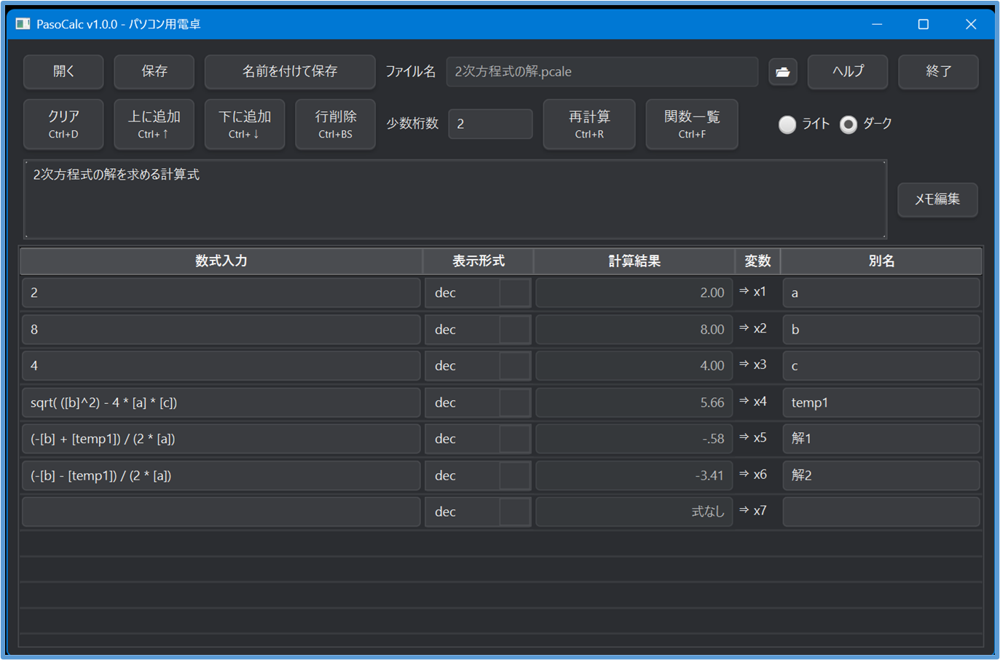

# PasoCalc — PC のための軽量・構造化された電卓アプリ

**PasoCalcは、計算を「行」として残しながら組み立てられる、Windows向けの軽量電卓です。**

電卓の手軽さと、Excelのような計算結果の再利用を両立。

**数式を上から並べるだけで、途中計算を残したまま計算できます。**

## ✨ 特徴

* 数式を行単位で管理
* 別名による計算結果の再利用
* 度数法などの便利な数学関数
* 16進数・2進数・日時の計算
* 計算内容を `.pcale` ファイルに保存
* ダーク／ライトテーマ
* メモ機能
* キーボードショートカット

## 🖥️ 動作環境

* Windows 10 / 11
* インストール不要
* ZIP展開のみ
* レジストリ未使用

## 📥 ダウンロード

最新版はGitHub Releasesからダウンロードできます。

👉 https://github.com/takeo-2026/PasoCalc-Release/releases

## 📷 画面例

この画面は、PasoCalc を使って **2次方程式の解を求めている例**です。  
各行に数式を入力すると、上から順に評価され、計算結果は次の行の数式から  
変数として参照できます。

## ▶️ 使い方

1. ZIP を展開して `PasoCalc.exe` を起動  
2. 行に数式を入力（例：`1+1`）  
3. Enter または Tab で計算  
4. 別名（例：`a`, `b`, `temp1`）を設定すると、  
   下の行で `[a]` のように参照可能  
5. 「下に追加」ボタンで行を追加  

## 📘 関連記事

PasoCalcの開発経緯や独自機能については、Qiitaで順次公開予定です。

* PasoCalcの設計・開発経緯
* exp4jによる構文解析（パース）について
* 数式に利用できる変数、別名、リテラル、関数
* 計算結果の表示形式

※現在執筆中のため、公開後にリンクを追加します。

## 📄 ライセンス

本ソフトウェアは **無保証** で提供されます。
詳細については、同梱の `LICENSE` をご確認ください。

## ⚠️ 免責事項

本ソフトウェアの利用によって生じた損害について、作者は責任を負いません。

計算結果については、必要に応じて利用者自身でご確認ください。

## 👤 作者

**Takeo Saito**

https://github.com/takeo-2026
